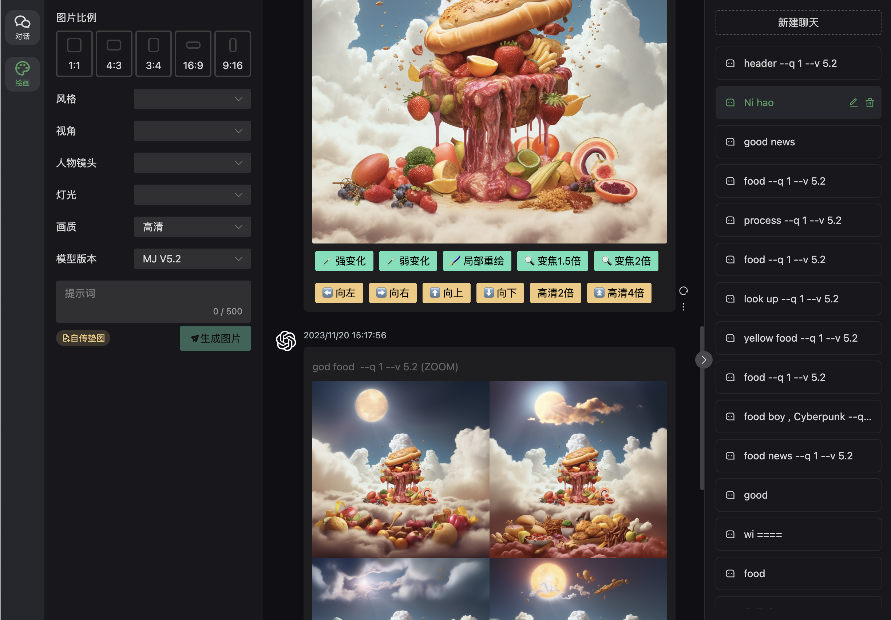

# ChatGPT Web Midjourney Proxy

- 声明：此项目只发布于 GitHub，基于 MIT 协议，免费且作为开源学习使用。并且不会有任何形式的卖号、付费服务、讨论群、讨论组等行为。谨防受骗。
- 本开源是在 [ChenZhaoYu](https://github.com/ChenZhaoYu/chatgpt-web) 上开源的 ；使用 [midjourney-proxy](https://github.com/novicezk/midjourney-proxy) 提供的midjourney api 作为后端而形成的。

## 支持的功能
- ✅ 原chatgpt web 所有功能
- ✅ midjourney 文生图
- ✅ midjourney 垫图+文生图  
- ✅ midjourney 图变 U1-U4 、 V1-V4、重绘等操作
- ✅ midjourney 支持局部重绘
- ✅ midjourney 支持1.5倍变焦 2倍变焦
- ✅ midjourney 支持2倍高清 4倍高清
- ✅ midjourney 支持左、右、上、下延伸变化
## 待开发
- ⏰ midjourney 图生文
- ⏰ 图片本地保存

## 更多展示
局部重绘：

手机端：

 
 
 

## License
MIT © [ChenZhaoYu && Novicezk  && Dooy](./license)
