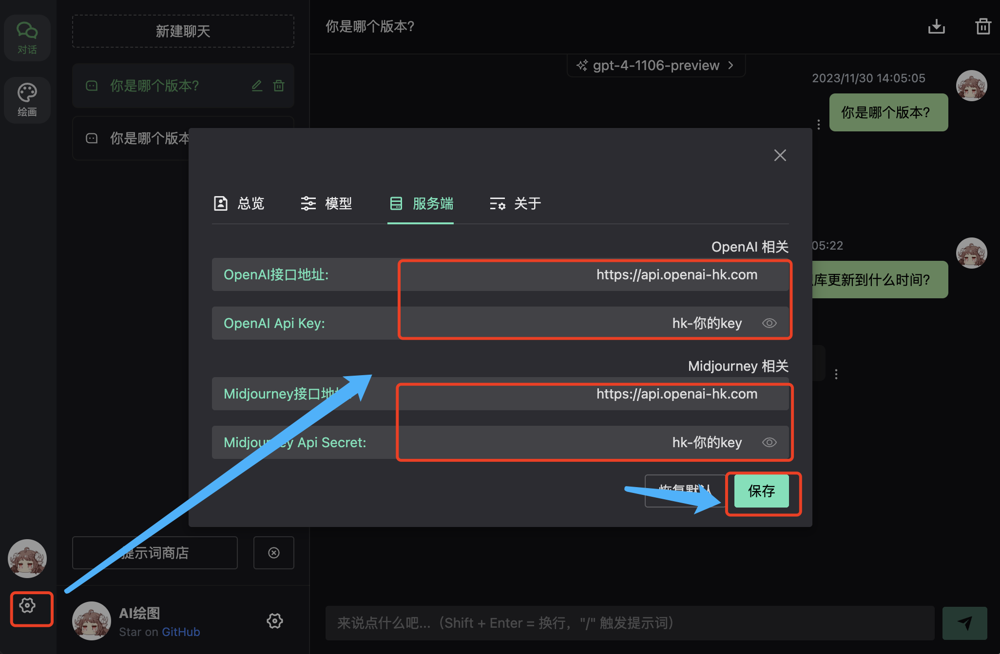

# ChatGPT Web Midjourney Proxy
💡**声明**
- 此项目只发布于 GitHub，基于 MIT 协议，免费且作为开源学习使用。并且不会有任何形式的卖号、付费服务、讨论群、讨论组等行为。谨防受骗。
- 本开源是在 [ChenZhaoYu](https://github.com/Chanzhaoyu/chatgpt-web) 基础上做二次开发 ；使用 [midjourney-proxy](https://github.com/novicezk/midjourney-proxy) 提供的midjourney api 作为后端而形成的。


## 支持功能
- ✅ 原chatgpt web 所有功能
- ✅ chatgpt web 支持自定义api key、base_url
- ✅ midjourney 文生图
- ✅ midjourney 垫图+文生图  
- ✅ midjourney 图变 U1到U4 、 V1到V4、重绘等操作
- ✅ midjourney 支持局部重绘
- ✅ midjourney 支持1.5倍变焦 2倍变焦
- ✅ midjourney 支持2倍高清 4倍高清
- ✅ midjourney 支持左、右、上、下延伸变化
- ✅ midjourney 同时支持[midjourney-proxy](https://github.com/novicezk/midjourney-proxy) 接口 和 [midjourney-proxy-plus](https://github.com/litter-coder/midjourney-proxy-plus) 接口
- ✅ midjourney 图生文
- ✅ 图片使用localforage实现本地存储
- ✅ 支持midjourney、niji 不同机器人
- ✅ 支持[InsightFace 人脸替换](https://discord.com/api/oauth2/authorize?client_id=1090660574196674713&permissions=274877945856&scope=bot)
- ✅ midjourney 混图
- ✅ midjourney 获取 seed
- ✅ dall-e-3 画图
- ✅ chatgpt 前端选择模型
- ✅ chatgpt 前端支持自定义模型、上下文对话数、回复数
- ✅ chatgpt 支持图片上传图片 供gpt-4-vision-preview使用
## 待开发
- ⏰ 支持 niji・journey Bot， InsightFace 人脸服务
 
## docker 部署
**假设**:
- 你已经搭建好 [midjourney-proxy](https://github.com/novicezk/midjourney-proxy) 服务，开发端口服务器地址为 https://172.17.0.1:6013
- [midjourney-proxy](https://github.com/novicezk/midjourney-proxy) 服务 的 API_SECRET  为 abc123456
```bash
docker run --name chatgpt-web-midjourney-proxy  -d -p 6015:3002 \
-e OPENAI_API_KEY=sk-xxxxx \
-e OPENAI_API_BASE_URL=https://api.openai.com  \
-e MJ_SERVER=https://172.17.0.1:6013  \
-e MJ_API_SECRET=abc123456  ydlhero/chatgpt-web-midjourney-proxy
```
访问 http://ip:6015 
### midjourney-proxy API docker部署
更多参考到 [midjourney-proxy](https://github.com/novicezk/midjourney-proxy) 开源光光
```bash
docker run -d --name mj6013  -p 6013:8080  \
-e mj.discord.guild-id=discord服务ID  \
-e mj.discord.channel-id=discord服务组ID   \
-e mj.queue.timeout-minutes=6 \
-e mj.api-secret=abc123456 \
-e mj.discord.user-token=**********  \
--restart=always novicezk/midjourney-proxy:2.5.5
```


## 更多展示

### 自定义服务端api key、base_url：


### 局部重绘：
[](./docs/mj2.jpg)

### 换脸


### 混图


### 支持图片上传图片 供gpt-4-vision-preview使用

手机端：
<div style="display: flex; flex-wrap: wrap">
 
 
 
</div>


## License
MIT © [ChenZhaoYu && Novicezk  && Dooy](./license)
