# ChatGPT Web Midjourney Proxy
💡**선언**
- 이 프로젝트는 GitHub에만 게시되며, MIT 라이센스를 기반으로 무료로 오픈 소스 학습용으로 사용됩니다. 어떤 형태의 계정 판매, 유료 서비스, 토론 그룹 등의 행위도 없으니 사기를 조심하십시오.
- 이 오픈 소스는 [ChenZhaoYu](https://github.com/Chanzhaoyu/chatgpt-web)를 기반으로 2차 개발된 것이며, [midjourney-proxy](https://github.com/novicezk/midjourney-proxy)가 제공하는 midjourney API와 [Suno-API](https://github.com/SunoAI-API/Suno-API)를 백엔드로 사용하여 형성되었습니다.

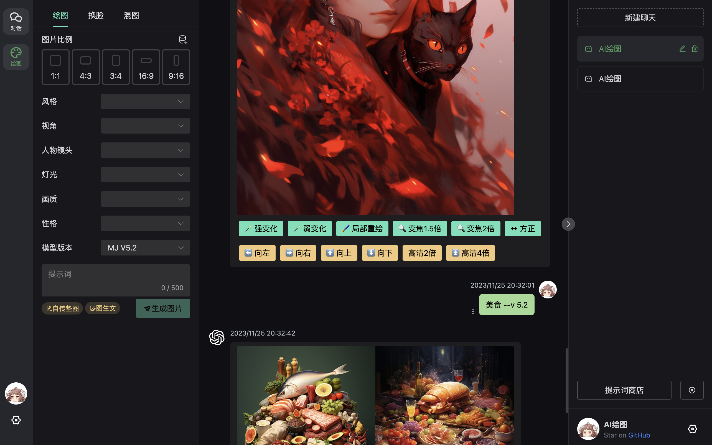
## 지원 기능
- [x] suno 단독 모듈 지원, 가사 조정, 곡 스타일 조정 가능
- [x] 원래 chatgpt 웹의 모든 기능
- [x] chatgpt 웹 지원 사용자 정의 API 키, base_url
- [x] midjourney 텍스트로 이미지 생성
- [x] midjourney 텍스트와 이미지로 이미지 생성
- [X] midjourney 이미지 변환 U1에서 U4, V1에서 V4, 재그리기 등 작업
- [X] midjourney 부분 재그리기 지원
- [X] midjourney 1.5배 확대, 2배 확대 지원
- [X] midjourney 2배 HD, 4배 HD 지원
- [X] midjourney 좌, 우, 상, 하 확장 지원
- [X] midjourney와 [midjourney-proxy](https://github.com/novicezk/midjourney-proxy) 인터페이스 및 [midjourney-proxy-plus](https://github.com/litter-coder/midjourney-proxy-plus) 인터페이스 동시 지원
- [X] midjourney 이미지에서 텍스트 생성
- [X] localforage를 사용한 이미지 로컬 저장
- [X] midjourney 및 niji 다양한 로봇 지원
- [X] [InsightFace 얼굴 교체](https://discord.com/api/oauth2/authorize?client_id=1090660574196674713&permissions=274877945856&scope=bot) 지원
- [X] midjourney 이미지 합성
- [X] midjourney 시드 가져오기
- [X] dall-e-3 이미지 생성
- [X] chatgpt 프론트엔드 모델 선택
- [X] chatgpt 프론트엔드 사용자 정의 모델, 대화 수, 응답 수 지원
- [X] chatgpt 이미지 업로드 지원 gpt-4-vision-preview 사용
- [X] chatgpt 파일 백엔드 업로드 지원(gpt-4-all, gpt-4-gizmo-xxx 모델) 기본적으로 비활성화됨, 활성화하려면 환경 변수 API_UPLOADER=1 필요
- [X] chatgpt 역모델 지원 gpt-4-all, gpt-4-v, gpt-4-gizmo-(gizmo_id)
- [X] chatgpt 초링크 모델 전환 지원 https://vercel.ddaiai.com/#/m/gpt-4-all https://vercel.ddaiai.com/#/m/gpt-4-gizmo-g-2fkFE8rbu
- [X] ChatGPT 실시간 초링크 모델 전환 지원 https://chat.openai.com/g/g-2fkFE8rbu를 https://vercel.ddaiai.com/#/g/g-2fkFE8rbu로 변경
- [X] chatgpt GPTs 다중 모드 지원
- [X] chatgpt tts whisper 지원
- [X] 즉시 음성 인식(브라우저 기본 음성 인식 ASR) `v2.15.7` 이상 버전
- [X] 초링크 설정 변경 지원, `one-api`, `new-api` 배포 채팅에 적합 https://vercel.ddaiai.com/#/s/t?OPENAI_API_BASE_URL=https://abc.com&OPENAI_API_KEY=sk-xxxxx&MJ_SERVER=https://abc.com&MJ_API_SECRET=sk-xxx&UPLOADER_URL=
- [X] `one-api`, `new-api` 배포 채팅 지원 https://vercel.ddaiai.com/#/?settings={%22key%22:%22sk-abc%22,%22url%22:%22https://www.abc.com%22} `(v.2.14.3)`

## 서버리스 - 개인 데스크탑 설치
> - [x] https://github.com/Dooy/chatgpt-web-midjourney-proxy/releases에서 최신 버전 다운로드(운영 체제에 적합한 버전 선택)
> - [x] 적합한 중계 서비스 제공업체 선택(`gpt`, `gpts`, `midjourney`, `claude`, `suno`를 모두 지원하는 것이 좋음)
> - [x] 중계 서비스 제공업체 추천 https://www.openai-hk.com 하나의 `key`와 `api 인터페이스 주소` 동시에 `gpt`, `midjourney`, `claude`, `suno` 지원, mj-fast 최소 0.12rmb/장
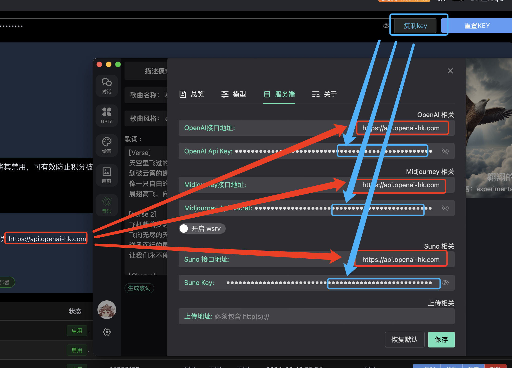

## Vercel 원클릭 배포

[](https://vercel.com/new/clone?repository-url=https://github.com/Dooy/chatgpt-web-midjourney-proxy&env=OPENAI_API_BASE_URL&env=OPENAI_API_KEY&env=MJ_SERVER&env=MJ_API_SECRET&project-name=chatgpt-web-midjourney-proxy&repository-name=chatgpt-web-midjourney-proxy)

## env 환경 변수

| 환경 변수 | 설명 | 기본값 |docker 등 배포| vercel 배포|
| --- | --- | --- | --- | --- |
| OPENAI_API_BASE_URL | OpenAI API 인터페이스 주소 | https://api.openai.com | ✅ |  ✅|
| OPENAI_API_KEY | OpenAI API 키 |  sk-xxxxx | ✅ |  ✅|
| OPENAI_API_MODEL |  기본 모델 | gpt-3.5-turbo  | ✅ |  ✅|
| MJ_SERVER |  mj 프록시 인터페이스 주소 |[구축 참고](https://github.com/novicezk/midjourney-proxy) | ✅ |  ✅|
| MJ_API_SECRET |  mj 프록시 | 비어 있음  | ✅ |  ✅|
| SUNO_SERVER |  SUNO API 인터페이스 주소 | [구축 참고](https://github.com/SunoAI-API/Suno-API) | ✅ |  ✅|
| SUNO_KEY |  SUNO API 키 | 비어 있음  | ✅ |  ✅|
| AUTH_SECRET_KEY |  접근 권한 암호 | 없음  | ✅ |   x|
| API_UPLOADER |  업로드 지원 | 비활성화됨  | ✅ |  x|
| HIDE_SERVER |  프론트엔드 UI 서버 숨김 |    | ✅ |  x|
| CUSTOM_MODELS |  사용자 정의 선택 가능한 모델 | 없음  | ✅ |  ✅|
| TJ_BAIDU_ID |  Baidu 통계 ID | 없음  | ✅ |  ✅|
| TJ_GOOGLE_ID |  Google 통계 ID | 없음  | ✅ |  ✅|
| SYS_NOTIFY |  시스템 알림, HTML 지원 | 없음  | ✅ |  ✅|
| DISABLE_GPT4 |  GPT-4 비활성화 | 없음  | ✅ |  ✅|
| GPT_URL | 사용자 정의 GPT_URL=/gpts.json  | 없음, 외부 링크도 가능 | ✅ |  ✅|
| UPLOAD_IMG_SIZE | gpt4v 업로드 이미지 크기 |  1 | ✅ |  ✅|
| SYS_THEME | 기본 테마 `light` 또는 `dark`  | dark | ✅ |  ✅|
| MJ_IMG_WSRV | `wsrv` 이미지 서버 활성화 여부  | 비활성화  | ✅ |  ✅|
| AUTH_SECRET_ERROR_COUNT | 폭파 방지 검증: 검증 횟수 NGINX 설정 `proxy_set_header X-Forwarded-For $remote_addr`  | 없음  | ✅ |  x|
| AUTH_SECRET_ERROR_TIME | 폭파 방지 검증: 대기 시간 단위 분  | 없음  | ✅ |  x|
| CLOSE_MD_PREVIEW | 입력 미리보기 비활성화 | 없음  | ✅ |  ✅|
| UPLOAD_TYPE | 업로드 방식 지정 [`R2` R2 업로드] [`API` UI 프론트엔드 중계] [`Container` 로컬 컨테이너] [`MyUrl` 사용자 정의 링크]  |  비어 있음 | ✅ |  x|
| MENU_DISABLE  | 메뉴 비활성화 옵션: gpts, draws, gallery, music |  비어 있음 | ✅ |  ✅|
| VISION_MODEL  | 기본 사용 이미지 인식 모델: `gpt-4o`, `gpt-4-turb`, `gpt-4-vision-preview` 등 |  비어 있음 | ✅ |  ✅|
| SYSTEM_MESSAGE

  | 사용자 정의 기본 역할 메시지 |  비어 있음 | ✅ |  ✅|
| CUSTOM_VISION_MODELS  | 사용자 정의 이미지 인식 모델, 쉼표로 구분 |  비어 있음 | ✅ |  ✅|

## docker 배포

> - [x] [midjourney-proxy](https://github.com/novicezk/midjourney-proxy) 지원 필요
> - [x] [Suno-API](https://github.com/SunoAI-API/Suno-API) 지원 필요

```bash
docker run --name chatgpt-web-midjourney-proxy  -d -p 6015:3002 \
-e OPENAI_API_KEY=sk-xxxxx \
-e OPENAI_API_BASE_URL=https://api.openai.com  \
-e MJ_SERVER=https://your-mj-server:6013  \
-e MJ_API_SECRET=your-mj-api-secret  \
-e SUNO_SERVER=https://your-suno-server:8000  \
-e SUNO_KEY=you-suno-key  ydlhero/chatgpt-web-midjourney-proxy
```
접속 http://ip:6015 

**파일 업로드**: 
```bash
docker run --name chatgpt-web-midjourney-proxy  -d -p 6015:3002 \
-e OPENAI_API_KEY=sk-xxxxx \
-e OPENAI_API_BASE_URL=https://api.openai.com  \
-e MJ_SERVER=https://172.17.0.1:6013  \
-e API_UPLOADER=1  -v /data/uploads:/app/uploads \
-e MJ_API_SECRET=abc123456  ydlhero/chatgpt-web-midjourney-proxy
```
프론트엔드 UI에서 OPENAI_API_KEY OPENAI_API_BASE_URL 설정 시; 이미지 업로드도 OPENAI_API_BASE_URL로 진행
```shell
curl -X POST -H "Content-Type: multipart/form-data" -F "file=@/path/to/file" http://OPENAI_API_BASE_URL/v1/upload
```
반환 형식
```json
{
"url":"https://xxxxxxx.jpg"
}
```

### midjourney-proxy API docker 배포
자세한 내용은 [midjourney-proxy](https://github.com/novicezk/midjourney-proxy) 오픈 소스를 참조
```bash
docker run -d --name mj6013  -p 6013:8080  \
-e mj.discord.guild-id=discord 서비스 ID  \
-e mj.discord.channel-id=discord 서비스 그룹 ID   \
-e mj.queue.timeout-minutes=6 \
-e mj.api-secret=abc123456 \
-e mj.discord.user-token=**********  \
--restart=always novicezk/midjourney-proxy:2.5.5
```

## 더 많은 예시

### 사용자 정의 서버 API 키, base_url:
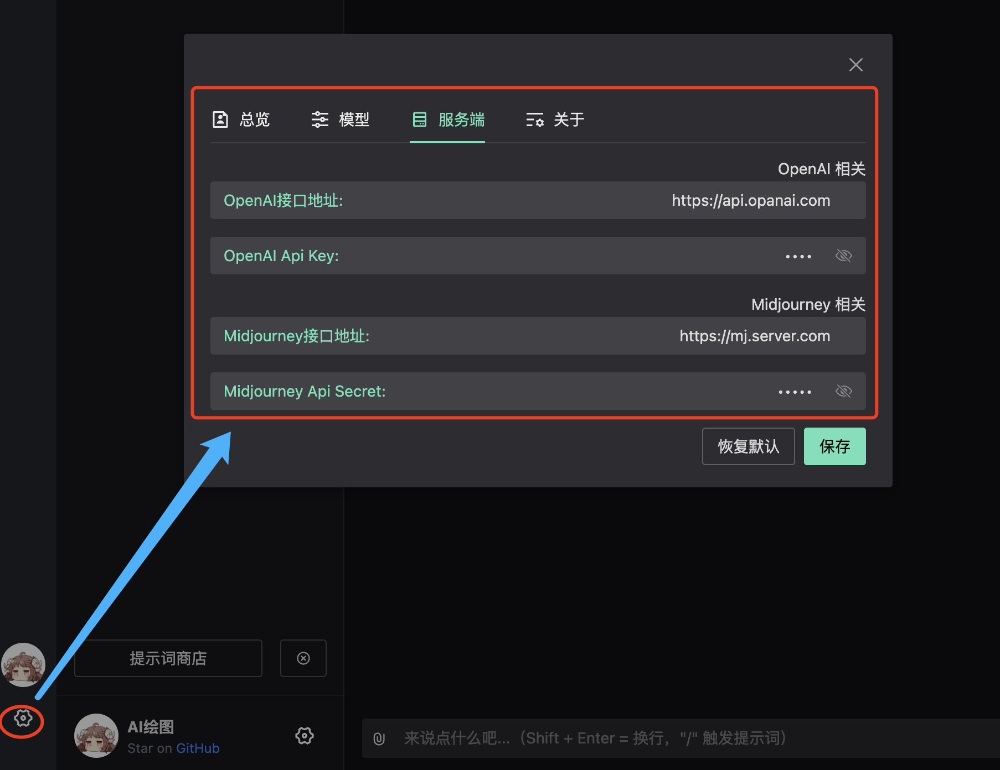

### GPTS GTP Store 
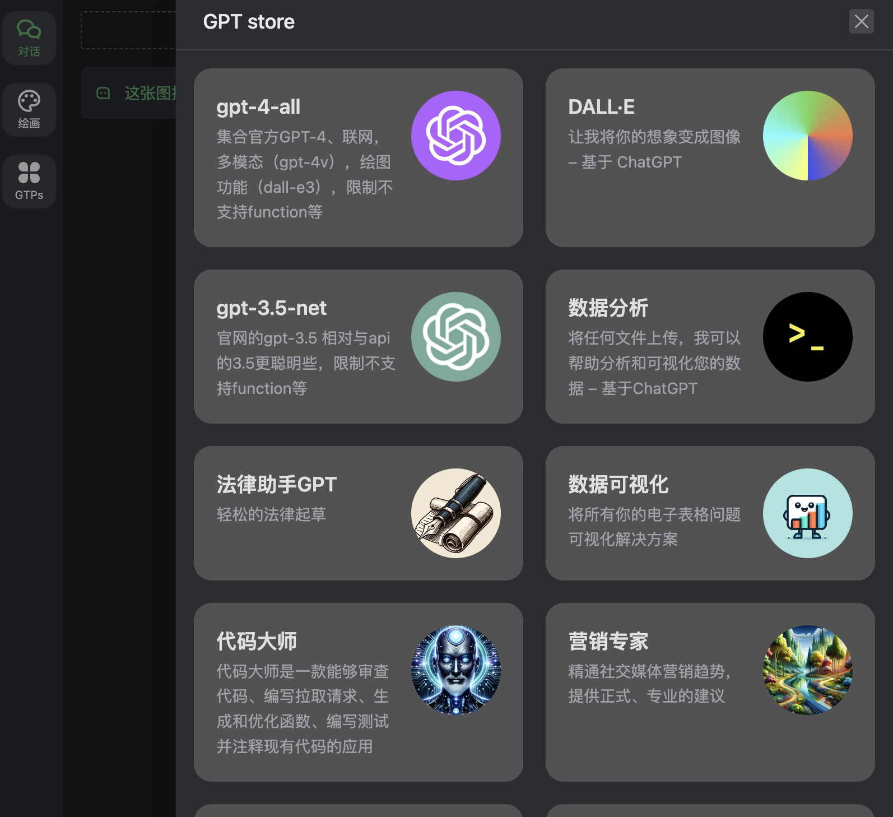


### suno 음악 제작
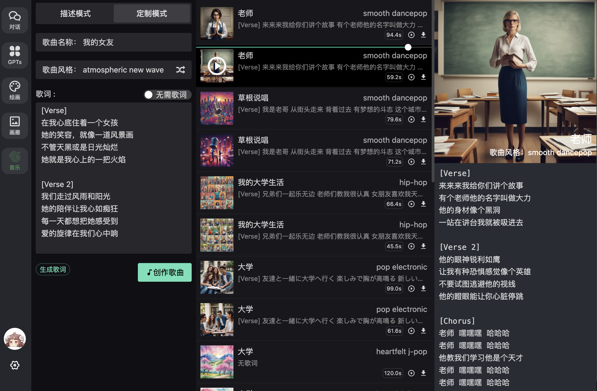

### 녹음 whisper와 tts
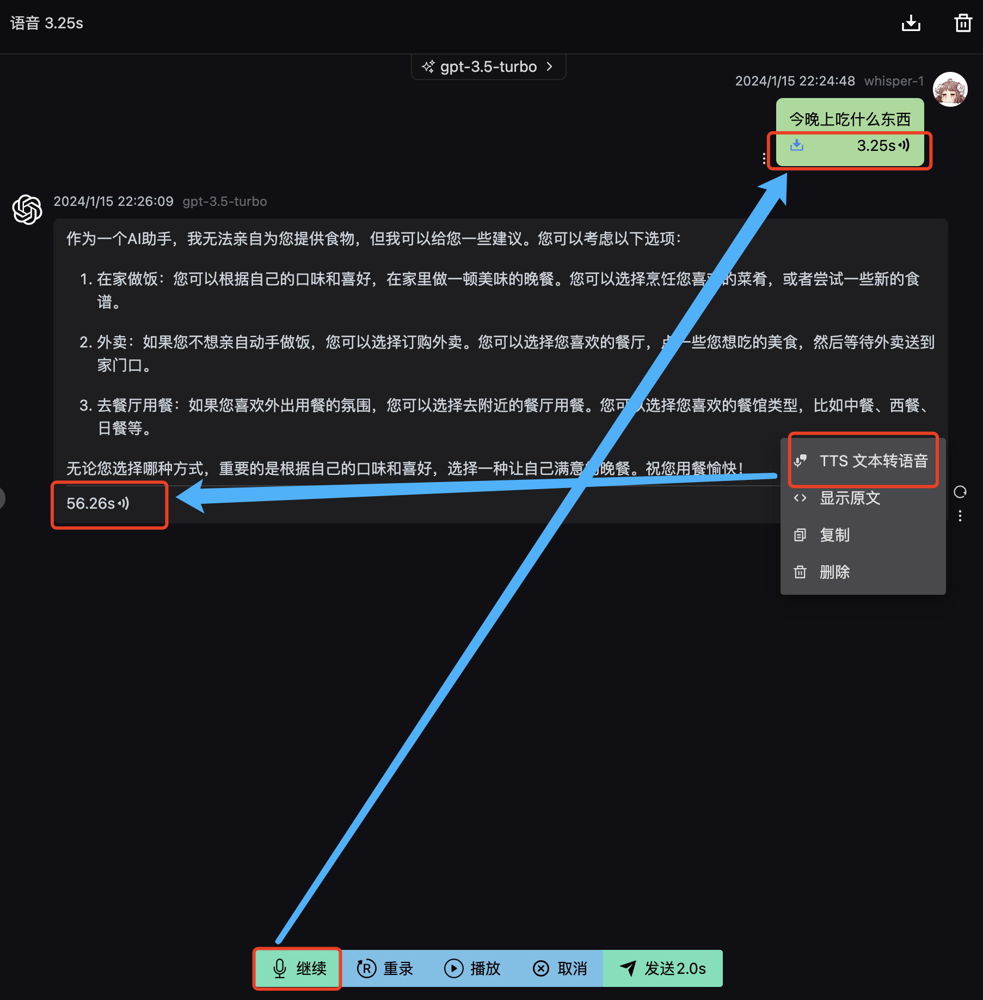

### 부분 재그리기:
[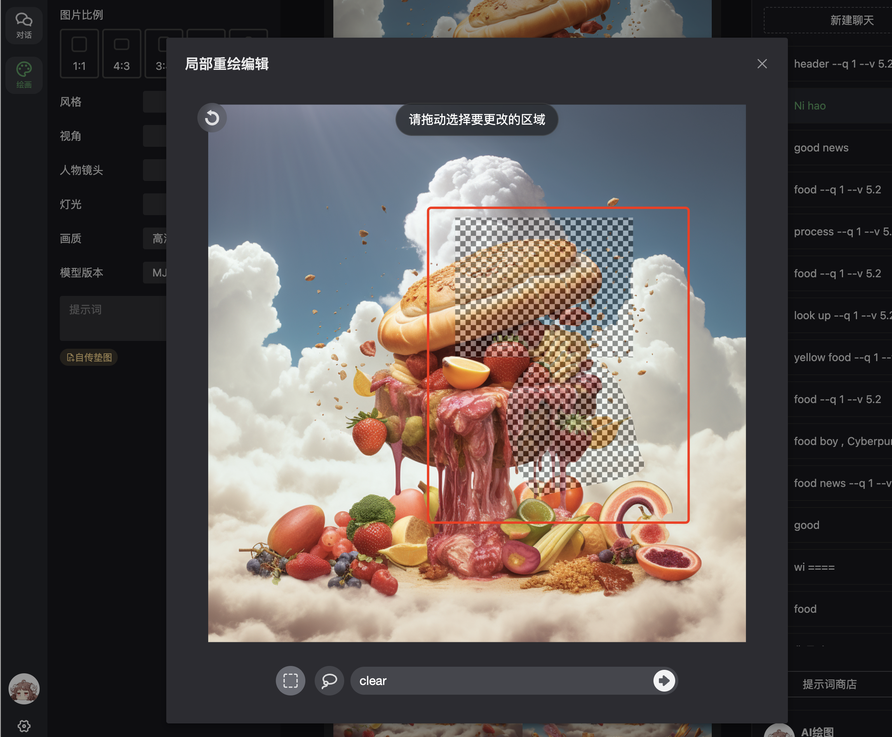](./docs/mj2.jpg)

### 얼굴 교체
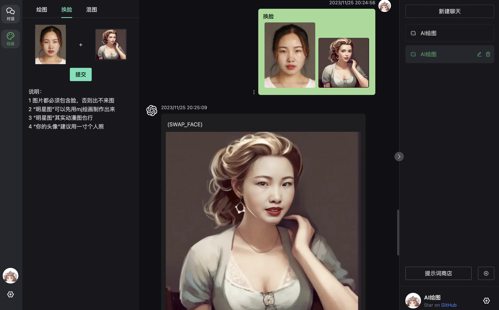

### 이미지 합성
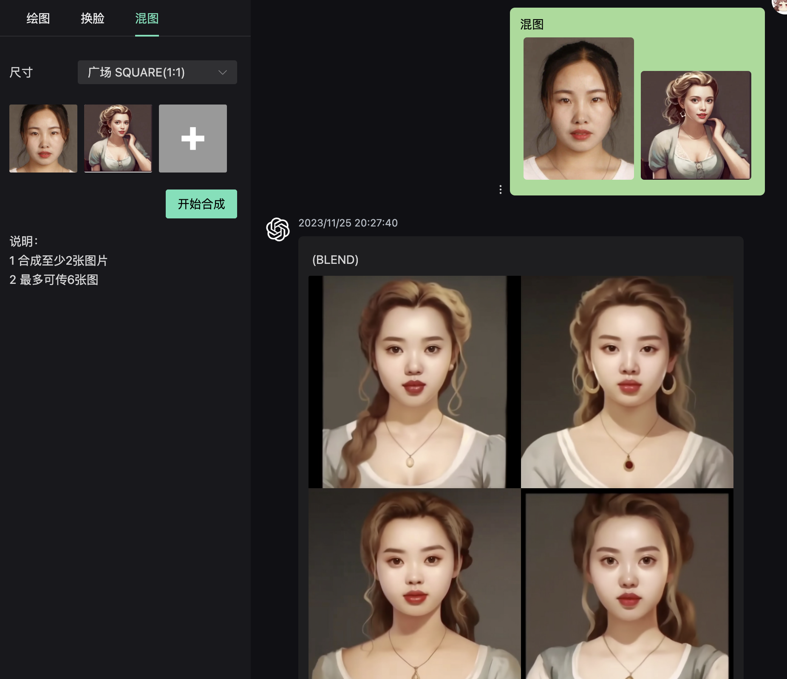

### gpt-4-vision-preview 사용을 위한 이미지 업로드 지원
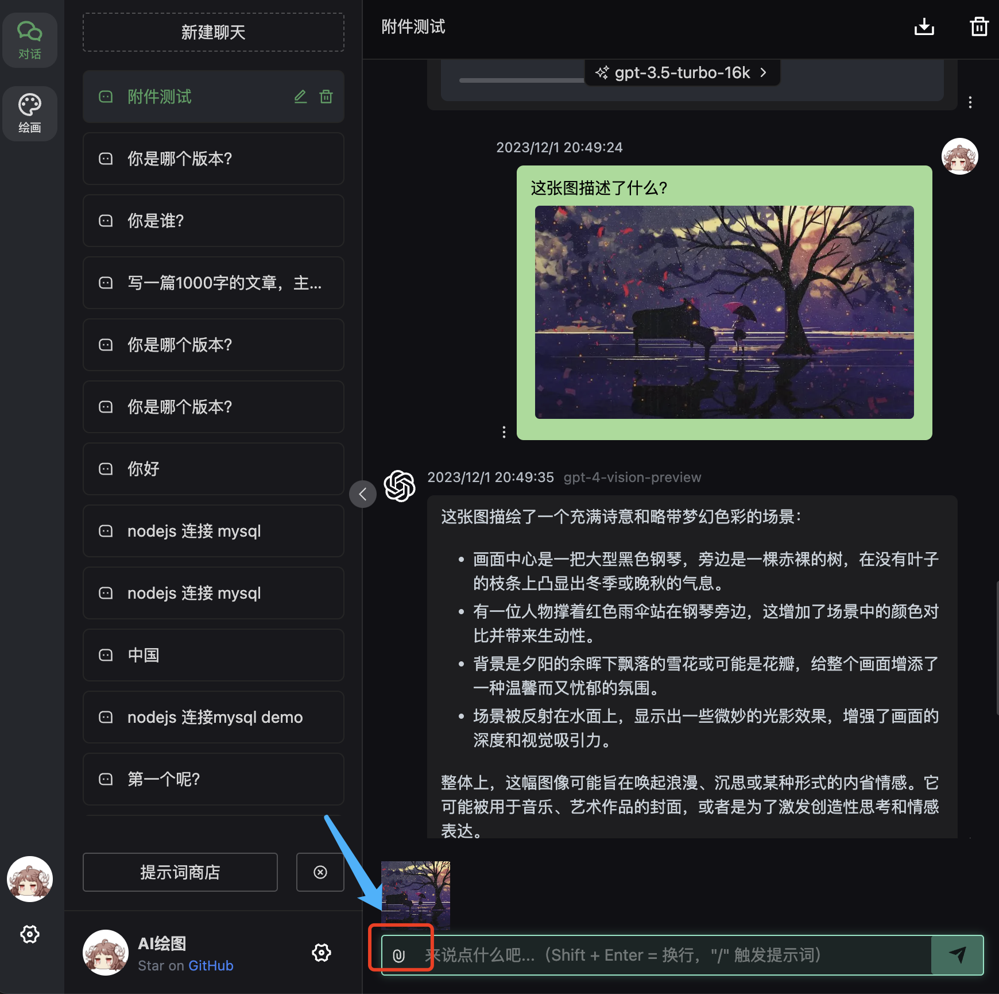
모바일:
<div style="display: flex; flex-wrap: wrap">
 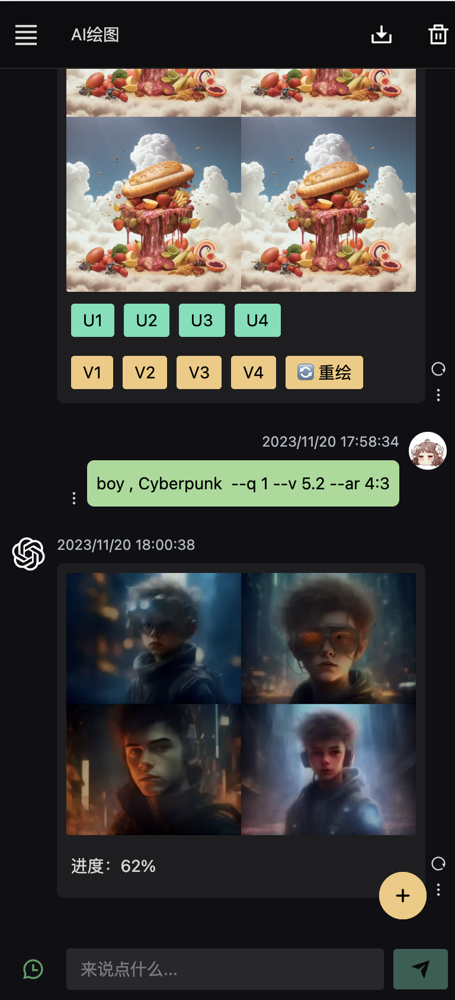
 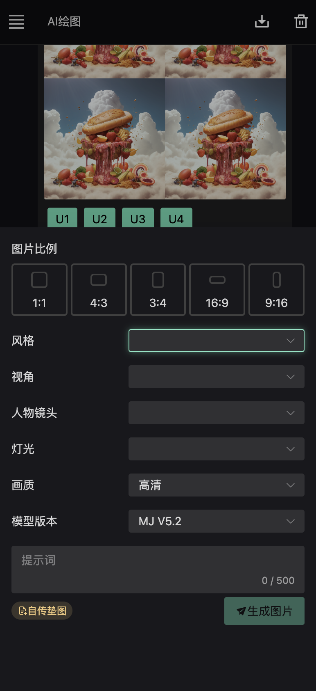
 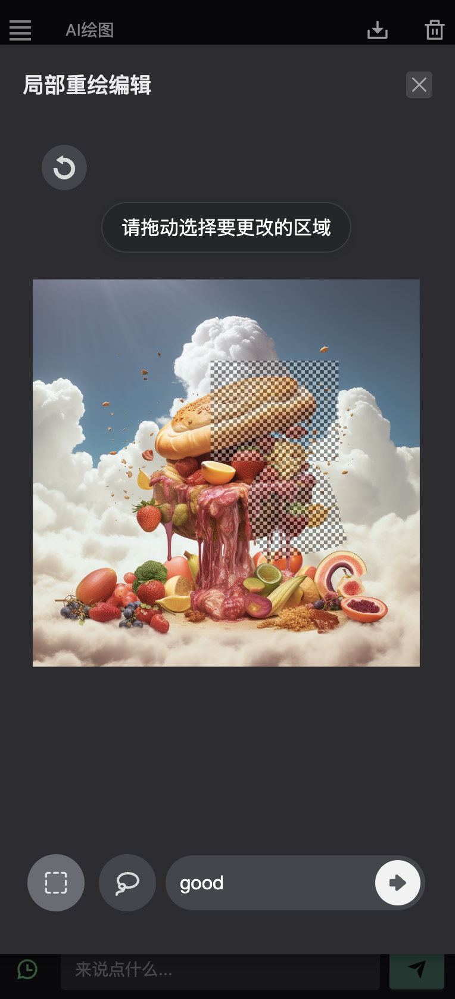
</div>

## 파일 업로드 Cloudflare R2 저장소 지원

- Cloudflare R2 저장소 10 GB/월 무료 https://www.cloudflare.com/ko-kr/developer-platform/r2/
- 구성 문서 참고 https://zhuanlan.zhihu.com/p/658058503
- Vercel은 R2 저장소를 지원하지 않음
```yml
R2_DOMAIN=
R2_BUCKET_NAME=
R2_ACCOUNT_ID=
R2_KEY_ID=
R2_KEY_SECRET=
```
## 파일 서버 요청 우선순위
R2 > 프론트엔드 UI 설정 파일 서버 > 백엔드 파일 서버 > 중계
## 폭파 방지 검증 설정

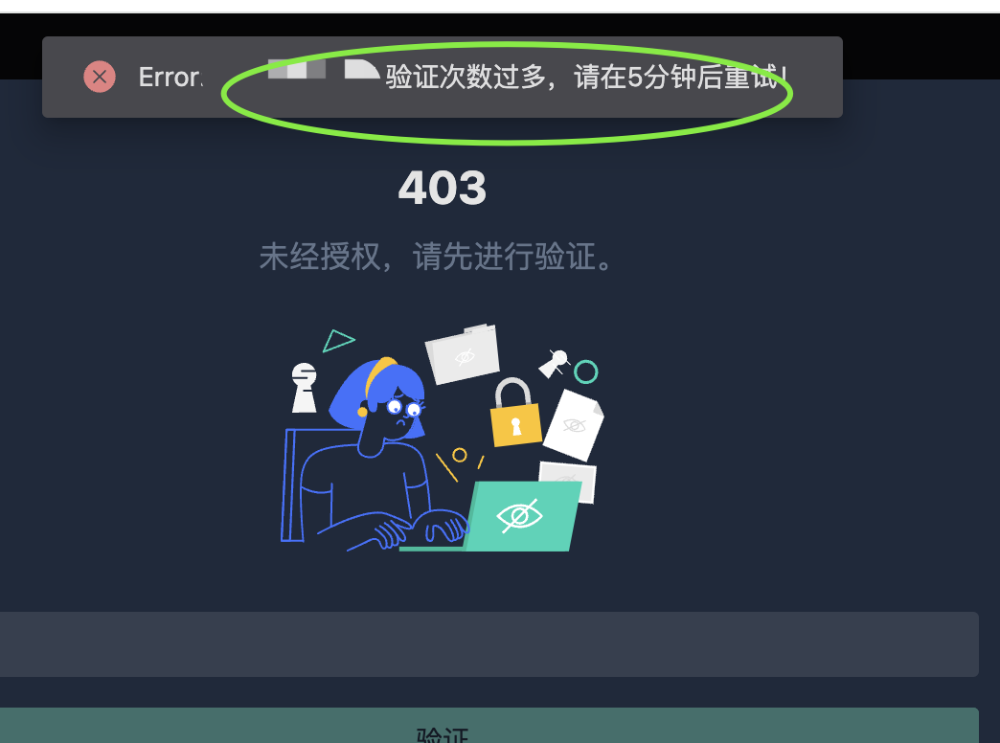
- [x] Vercel은 지원하지 않음; Docker 배포만 지원
- [x] 앞에 `nginx`를 장착한 경우 `proxy_set_header X-Forwarded-For $remote_addr;` 설정 필요
- [x] 매개변수는 다음과 같음: 3회 검증 오류 시 10분 후에만 다시 검증 가능
```yml
# 암호 주의: 영어 + 숫자만 사용
AUTH_SECRET_KEY=my888god
#폭파: 검증 횟수 주의: 숫자; nginx 설정 proxy_set_header X-Forwarded-For $remote_addr;
AUTH_SECRET_ERROR_COUNT=3
#폭파: 검증 대기 시간 단위 분 주의: 숫자
AUTH_SECRET_ERROR_TIME=10
```
- [x] 스크립트는 다음과 같음
```shell
docker run --name chatgpt-web-midjourney-proxy  -d -p 6015:3002 \
-e OPENAI_API_KEY=sk-xxxxx \
-e OPENAI_API_BASE_URL=https://api.openai.com  \
-e MJ_SERVER=https://172.17.0.1:6013  \
-e MJ_API_SECRET=abc123456 \
-e API_UPLOADER=1  -v /data/uploads:/app/uploads \
-e AUTH_SECRET_KEY=your_english_password -e AUTH_SECRET_ERROR_COUNT=3 \
-e AUTH_SECRET_ERROR_TIME=10 ydlhero/chatgpt-web-midjourney-proxy
```

## 라이센스
MIT © [Dooy](./license)

## 기타
이 프로젝트가 유용하다고 생각되면 star를 주거나 후원을 부탁드립니다

[](https://star-history.com/#Dooy/chatgpt-web-midjourney-proxy&Date)

## 후원
제 오픈 소스 프로젝트가 도움이 되었다면, 아래 방법 중 하나로 후원을 고려해 주세요: 
<br> `결제 메모에 연락처를 남겨 주세요`
<div style="display: flex; flex-wrap: wrap">
    <div style="width:200px">
        
        <div>WeChat 후원</div>
    </div>
    <div style="width:200px">
         
        <div>Alipay 후원</div>
    </div>
</div>